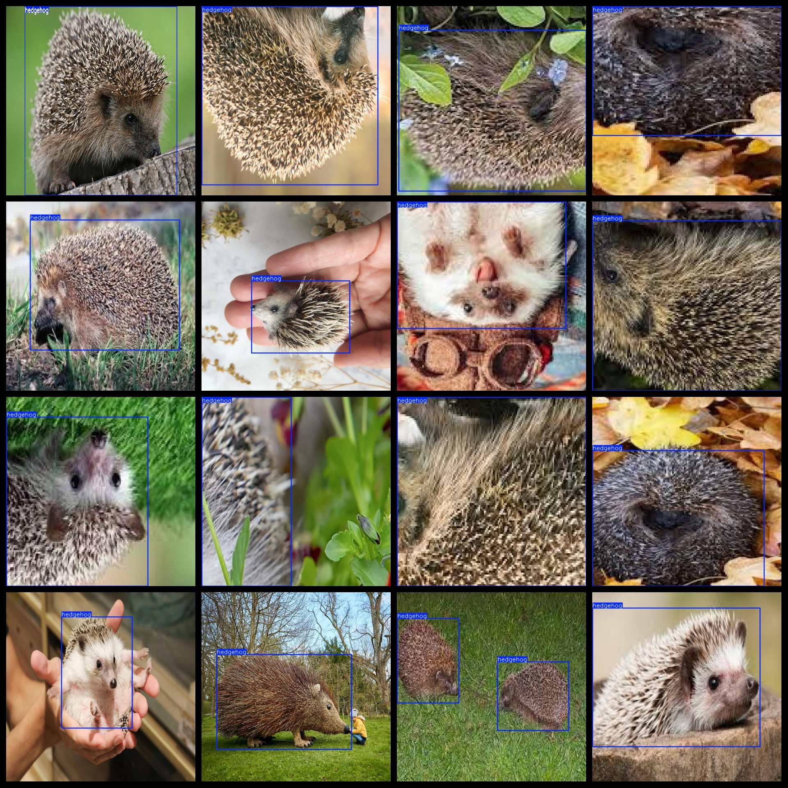
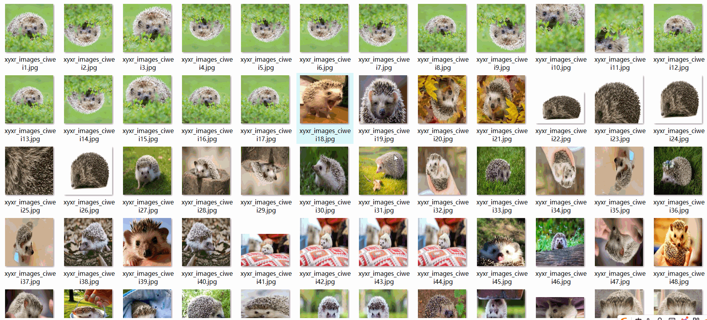

# [Object Detection] Hedgehog Dataset 3238 images in YOLO+VOC format

The dataset consists of 3238 images in both YOLO and VOC formats. The compression package includes 3 folders, each containing images, xml files, and txt files.

The JPEGImages folder contains a total of 3238 jpg images.

The Annotations folder contains a total of 3238 xml files.

The labels folder contains a total of 3238 txt files.

There are a total of 1 label types: "hedgehog".

Each label type has a box count (note that the yolo format class order does not correspond with this, as per the classes.txt file in the Labels folder):

- "hedgehog" box count = 3654

Total box count: 3654

The image resolution is clear (pixel).

The images have been enhanced.

Label shapes are rectangular boxes for target detection recognition.

Special notice: Images have been enhanced; if you don't mind, please do not shoot.

Special statement: This dataset does not guarantee the accuracy or reasonableness of the trained models or weight files. The dataset only provides accurate and reasonable annotations.

The annotation and image situation is as follows.

## Images

---

Here is a pay link on Stripe (https://buy.stripe.com/3cs8yP7sY87d0vu9AB). Please contact me lonlonago@foxmail.com after funding $89, and I will send you a complete data files, thank you!

